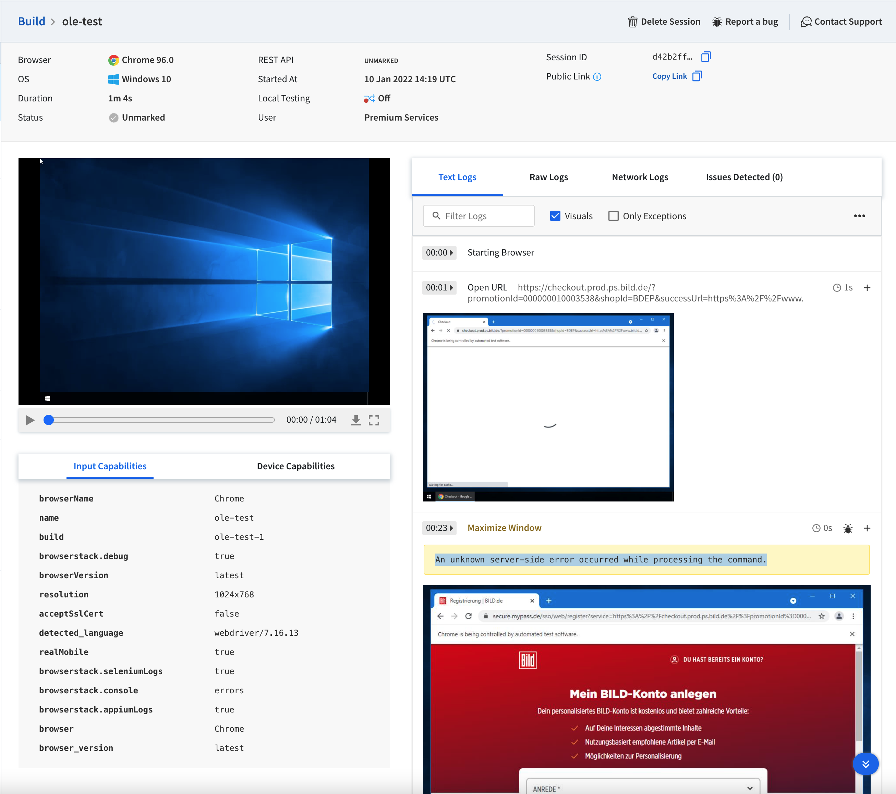
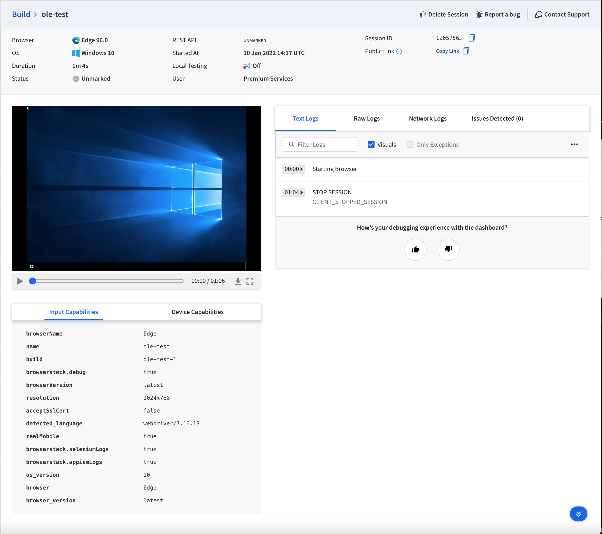
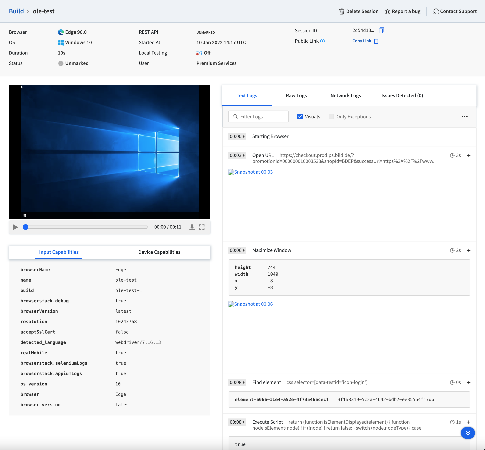

# Browserstack / Selenium Bug Report

Base setup for testing on Browserstack. Depends on [official Browserstack Repo](https://github.com/browserstack/webdriverio-browserstack).
Problems are relating to Selenium 4.1.0 and Edge / Chrome - latest versions.
All cases are tested on Windows and on Mac OSX.

## Setup

```sh
yarn --frozen-lockfile
BROWSERSTACK_USERNAME=*** BROWSERSTACK_PASSWORD=*** yarn run test
```

## Known problems for testing

### Chrome

Browser Version: 96  
Selenium Version: 4.1.0  
Chrome does have the problem with `browser.maximizeWindow()`. Tests are failing with the following message:
"An unknown server-side error occurred while processing the command.". If we comment the line out Chrome works as expected.



### Edge

Browser Version: 96  
Selenium Version: 4.1.0
Edge does succeed randomly. If the test fails we get a webdriver timeout exceeded message in the console.  
**Failed state:**  
  
**Success State**


### Firefox

Firefox should work as expected.
